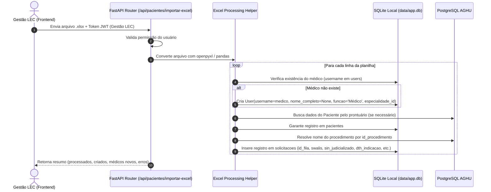

# Design: Importação de Planilha Excel de Pacientes por Especialidade (Gestão LEC)

## Visão Geral

A solução consiste em uma funcionalidade de importação self-service no frontend para a equipe de **Gestão LEC**, integrada a um endpoint no backend que processa arquivos Excel de filas legadas. O parser lê os dados por linha, realiza a autocriação de médicos responsáveis não cadastrados, faz a resolução de nomes de procedimentos e cadastra o histórico/solicitação dos pacientes.

---

## Mapeamento e Regras das Colunas da Planilha

| Coluna Excel | Nome da Coluna | Campo Alvo no Sistema | Regra / Tratamento |
| :--- | :--- | :--- | :--- |
| **A** | `id_fila` | `solicitacoes.id_fila` | Identificador da fila do procedimento. |
| **B** | `Prontuário` | `pacientes.prontuario` | Busca paciente no AGHU/banco local; se não existir, cria registro básico com o prontuário. |
| **C** | `id_procedimento` | `solicitacoes.id_procedimento` / `nome_procedimento` | Mapeia o ID do procedimento do AGHU. Obtém a descrição do procedimento no AGHU para gravação. |
| **D** | `medico_responsavel` | `users.username` / `solicitacoes.medico_responsavel` | Armazena o usuário EBSERH. Se não houver `User` com esse `username` para a especialidade: cria usuário com `nome_completo = None` e atribui à especialidade. Exibe o `username` até que o nome seja preenchido. |
| **E** | `sin_oncologico` | *(ignorado)* | Reservado para uso futuro. |
| **F** | `uti` | *(ignorado)* | Reservado para uso futuro. |
| **G** | `id_motivo_status` | `solicitacoes.id_motivo_status` | Identificador do motivo/status inicial da solicitação. |
| **H** | `sin_rt` | *(ignorado)* | Reservado para uso futuro. |
| **I** | `id_especialidade` | `solicitacoes.id_especialidade` | Código da especialidade AGHU associado à fila. |
| **J** | `swalis` | `solicitacoes.swalis` | Valor de prioridade SWALIS. |
| **K** | `sin_judicializado` | `solicitacoes.sin_judicializado` | Converte valores (`S`/`N`, `1`/`0`, `Sim`/`Não`, `True`/`False`) para booleano. |
| **L** | `dth_indicação` | `solicitacoes.dth_indicacao` | Data/hora da indicação cirúrgica (parse de formatos datetime comuns do Excel). |

---

## Fluxo de Execução Backend

---

## Mudanças na Interface (Frontend)

1. **Botão no Menu Pacientes**:
   - Em `PacientesView.vue`, insere botão `"Importar Planilha"` com ícone de upload, visível se `authStore.currentProfile === 'Gestão LEC'`.
2. **Modal `ImportarPlanilhaPacientesModal.vue`**:
   - Seletor de arquivo `.xlsx` / `.xls`.
   - Exibição de instruções com a estrutura de colunas esperada (A até L).
   - Indicador de carregamento durante a requisição.
   - Painel de resultado com feedback claro:
     - Total de linhas processadas.
     - Quantidade de solicitações e pacientes cadastrados/atualizados.
     - Lista de novos médicos cadastrados sem nome completo.
     - Erros/avisos encontrados por linha (se houver).
